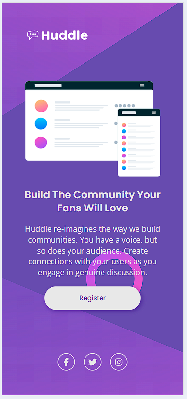
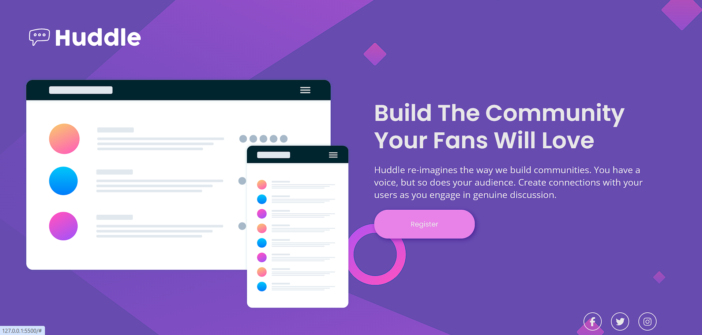

# Huddle Landing Page - HTML + CSS

Este projeto é uma landing page responsiva inspirada no layout "Huddle", desenvolvida utilizando apenas **HTML** e **CSS**. O objetivo principal foi praticar responsividade, organização de layout com **Flexbox** e **Grid**, além de aplicar boas práticas de estruturação de código e uso de variáveis CSS. O projeto faz parte da Quest do Dev em Dobro.

## 📸 Preview

 
 

## 🚀 Tecnologias Utilizadas

- HTML5
- CSS3
- CSS Grid & Flexbox
- Responsividade com Media Queries
- Font Awesome para ícones
- Google Fonts (Poppins e Open Sans)

## 📁 Estrutura de Arquivos

project-root/  
│ 
├── index.html 
├── README.md 
├── src/ 
│ ├── css/ 
│ │ ├── reset.css 
│ │ ├── style.css 
│ │ ├── responsive.css 
│ │ └── variables.css 
│ └── images/ 
│ ├── bg-desktop.svg 
│ ├── bg-mobile.svg 
│ ├── illustration-mockups.svg 
│ └── logo.svg

## 💡 Funcionalidades

- Layout responsivo para dispositivos móveis
- Alteração de imagem de fundo entre versões mobile e desktop
- Ícones interativos de redes sociais no rodapé
- Botão com hover estilizado

## ✅ Melhorias Futuras

- Adição de um formulário funcional
- Versão com tema claro

## 🔗 Créditos

Design baseado no desafio **Frontend Mentor - Huddle landing page with single introductory section**.

Ícones fornecidos por [Font Awesome](https://fontawesome.com/)

---

Feito por [Junior.OLeandro]